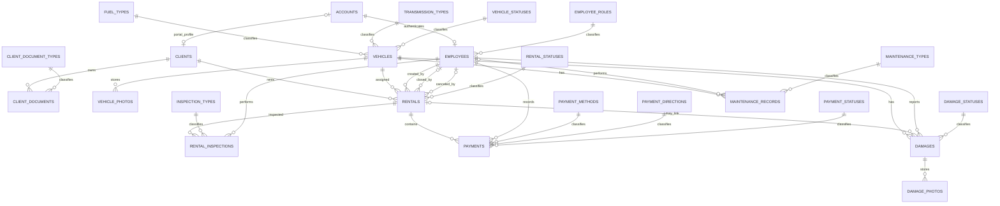

# Car Rental DB Coursework Package

## 1. Scope

This package describes the current business schema used by the car rental system after the deep schema redesign.

Included artifacts:

- ER model with business and lookup entities only
- normalization notes up to 3NF
- PostgreSQL DDL script
- seed DML script
- analytical SQL queries and views
- integrity verification queries

`__EFMigrationsHistory` and `ContractSequences` are intentionally excluded from the defense ER model because they are technical tables, not domain entities.

## 2. ER Diagram

Optionality notes used in the defense model:

- `Clients.AccountId` is `0..1`
- `Rentals.ClosedByEmployeeId` is `0..1`
- `Rentals.CanceledByEmployeeId` is `0..1`
- `Rentals.EndMileage` is `0..1`
- `Rentals.ClosedAtUtc` is `0..1`
- `Rentals.CanceledAtUtc` is `0..1`
- `Rentals.CancellationReason` is `0..1`
- `Damages.RentalId` is `0..1`
- `MaintenanceRecords.PerformedByEmployeeId` is `0..1`
- `MaintenanceRecords.ServiceProviderName` is `0..1`
- `Payments.ExternalTransactionId` is `0..1`

## 3. Lookup Legend

Lookup tables replace opaque integers in the defense model:

| Lookup table | Values |
| --- | --- |
| `EmployeeRoles` | `1=Admin`, `2=Manager`, `3=User` |
| `RentalStatuses` | `1=Booked`, `2=Active`, `3=Closed`, `4=Canceled` |
| `PaymentMethods` | `1=Cash`, `2=Card` |
| `PaymentDirections` | `1=Incoming`, `2=Refund` |
| `PaymentStatuses` | `1=Pending`, `2=Completed`, `3=Canceled`, `4=Refunded` |
| `InspectionTypes` | `1=Pickup`, `2=Return` |
| `DamageStatuses` | `1=Open`, `2=Charged`, `3=Resolved` |
| `VehicleStatuses` | `READY`, `RENTED`, `MAINTENANCE`, `DAMAGED`, `INACTIVE` |
| `ClientDocumentTypes` | `PASSPORT`, `DRIVER_LICENSE` |
| `MaintenanceTypes` | `SCHEDULED`, `REPAIR`, `TIRES`, `INSPECTION` |

## 4. Business Tables

### 4.1 Accounts and people

- `Accounts` stores authentication state only.
- `Employees` stores staff profile and role.
- `Clients` stores customer profile, blacklist state, and optional portal linkage.
- `ClientDocuments` stores passport and driver-license facts as separate rows with `ExpirationDate date`.

### 4.2 Fleet

- `Vehicles` stores atomic technical characteristics plus lookup-based status.
- `VehiclePhotos` stores one-to-many vehicle images.
- Availability is not persisted; it is computed from:
  - `NOT Vehicles.IsDeleted`
  - `Vehicles.VehicleStatusCode = 'READY'`
  - no overlapping `Booked` or `Active` rental for the selected period

### 4.3 Operations

- `Rentals` keeps the lifecycle through `Status`, `ClosedAtUtc`, `CanceledAtUtc`, and actor FKs.
- `RentalInspections` stores pickup and return inspections separately.
- `Payments` stores method, direction, status, and optional external transaction id.
- `Damages` keeps repair and charge facts, with DB-level consistency between `RentalId` and `VehicleId`.
- `DamagePhotos` stores one-to-many evidence images.
- `MaintenanceRecords` stores service events with optional performer and provider.

## 5. Normalization

### 5.1 1NF

All persisted attributes are atomic:

- no UI-ready spec strings are stored in `Vehicles`;
- client documents are separated into `ClientDocuments`;
- vehicle and damage media are separated into `VehiclePhotos` and `DamagePhotos`;
- inspection stages are stored as separate `RentalInspections` rows.

### 5.2 2NF

All main transactional relations use a single-column surrogate key (`Id`) or a stable lookup key (`Code`), so partial dependency on a composite key does not occur.

### 5.3 3NF

| Relation | Key | 3NF result |
| --- | --- | --- |
| `Accounts` | `Id` | authentication state is isolated from business profiles |
| `Employees` | `Id` | staff profile depends only on employee key; role meaning is delegated to lookup |
| `Clients` | `Id` | customer profile depends only on client key; documents are separated |
| `ClientDocuments` | `Id` | one document fact per row, typed by lookup |
| `Vehicles` | `Id` | technical characteristics and status depend only on vehicle key |
| `Rentals` | `Id` | lifecycle and actors are explicit, without duplicated boolean flags |
| `Payments` | `Id` | payment event facts are isolated from rental header data |
| `Damages` | `Id` | charge semantics are derived from `Status` and `ChargedAmount`, not duplicated booleans |
| `MaintenanceRecords` | `Id` | service facts depend only on the maintenance record key |

## 6. Integrity Rules

Implemented through `FK`, `UNIQUE`, filtered indexes, `CHECK`, and a PostgreSQL exclusion constraint:

- `Accounts.Login` is unique
- `Employees.AccountId` is unique
- `Clients.AccountId` is unique when present
- `Clients.Phone` is unique among non-deleted clients
- `(ClientDocuments.DocumentTypeCode, ClientDocuments.DocumentNumber)` is unique among non-deleted documents
- `Vehicles.LicensePlate` is unique among non-deleted vehicles
- `Rentals.ContractNumber` is unique
- `Damages.ActNumber` is unique
- `Payments.ExternalTransactionId` is unique when present
- `(RentalInspections.RentalId, RentalInspections.Type)` is unique
- `(VehiclePhotos.VehicleId, VehiclePhotos.SortOrder)` and `(DamagePhotos.DamageId, DamagePhotos.SortOrder)` are unique
- `Rentals.StartDate <= Rentals.EndDate`
- `Rentals.EndMileage >= Rentals.StartMileage`
- `FuelPercent` stays in `0..100`
- non-negative money and mileage are enforced
- `Damages.Status` stays consistent with `ChargedAmount`
- `Damages (RentalId, VehicleId)` must match the linked rental
- no overlapping `Booked` or `Active` rentals exist for the same vehicle

## 7. Time Model

The schema follows one rule set:

- all `...Utc` columns use `timestamp with time zone`
- operational local-time facts keep `timestamp without time zone`
- document expiration uses `date`

This removes the mismatch where UTC was claimed by naming but not guaranteed by type.

## 8. SQL Package

- `sql/01_schema_postgres.sql` - DDL, lookup tables, constraints, indexes, exclusion constraint, helper function
- `sql/02_seed_postgres.sql` - minimal seed data aligned with the redesigned schema
- `sql/03_views_and_reports.sql` - views and analytical queries
- `sql/04_integrity_checks.sql` - verification queries for defense and smoke checks

## 9. Defense Notes

- show business and lookup entities only on the final ER diagram
- do not show `__EFMigrationsHistory`
- do not show `ContractSequences` on the defense ER diagram; explain it separately as a technical contract-number counter
- explain availability as a computed read-model rule, not a stored fact
- explain that authentication is separated into `Accounts`, while `Employees` and `Clients` keep business profiles
